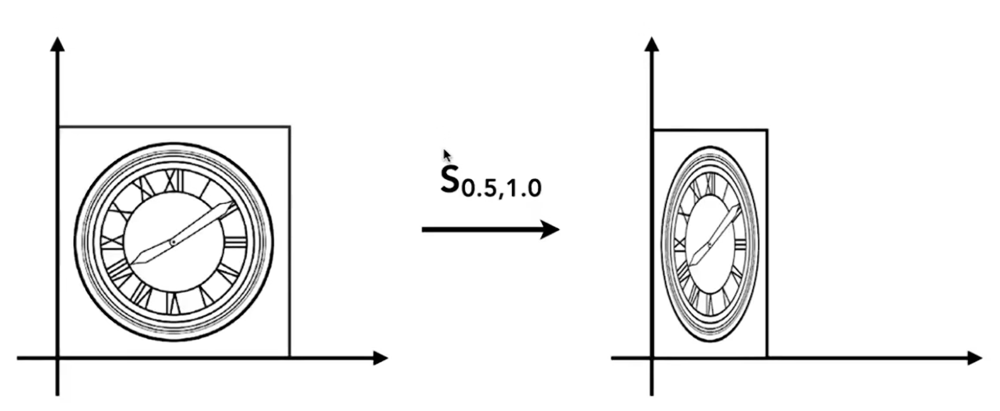
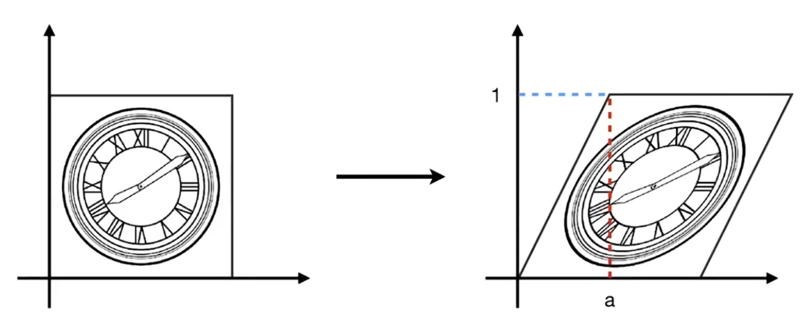
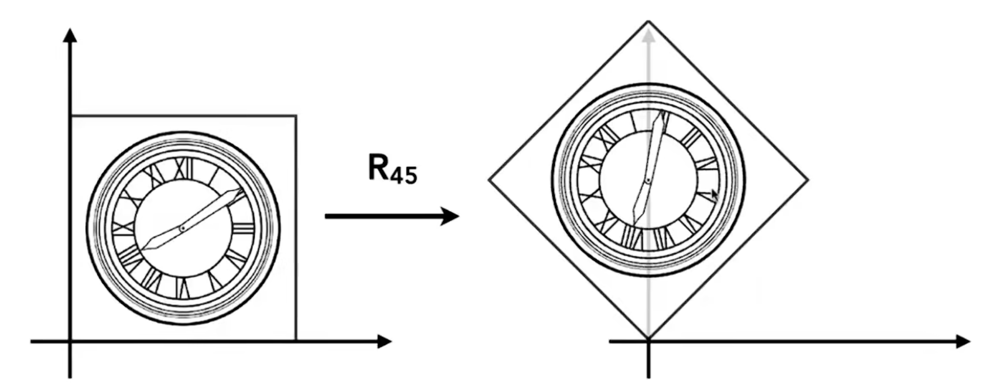
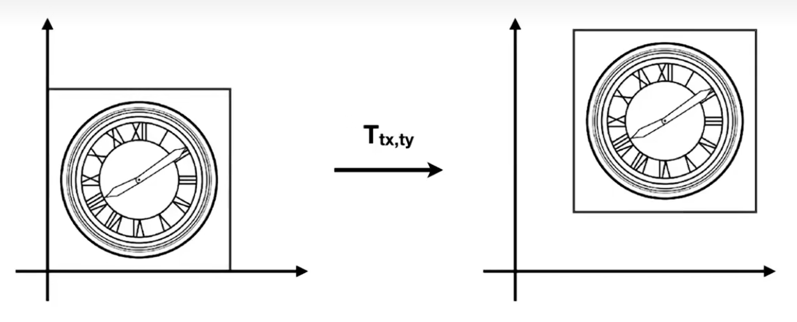
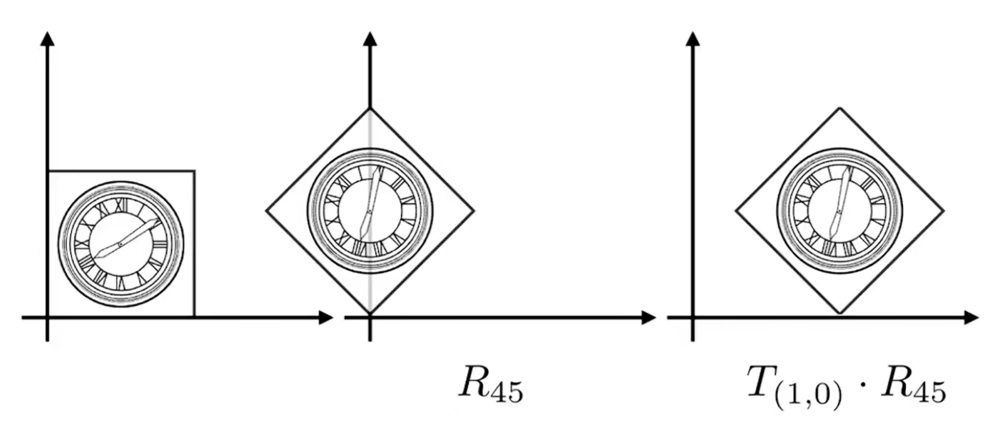
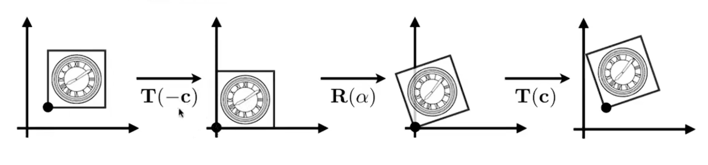

## 1 二维变换

### 1.1 缩放

下图是将原图形的$x$坐标和$y$坐标都变为原来的$\frac{1}{2}$倍，即：

$$
x'= \frac{1}{2} x \\
y'= \frac{1}{2} y
$$

写为矩阵形式：

$$
\begin{pmatrix}
x' \\ y'
\end{pmatrix}
 = 
\begin{pmatrix}
\frac{1}{2} & 0 \\
0 & \frac{1}{2}
\end{pmatrix}

\begin{pmatrix}
x \\ y
\end{pmatrix}
$$

$x$坐标和$y$坐标可以不均匀地缩放，如下图变换的矩阵形式可以写为：

$$
\begin{pmatrix}
x' \\ y'
\end{pmatrix}
 = 
\begin{pmatrix}
1 & 0 \\
0 & \frac{1}{2}
\end{pmatrix}

\begin{pmatrix}
x \\ y
\end{pmatrix}
$$

矩阵$\begin{pmatrix} s_x & 0 \\\ 0 & s_y \end{pmatrix}$称为**缩放矩阵**，他是一个对角阵.

### 1.2 对称

下图是将原图关于$y$轴做对称变换，这个变换可以表示为：

$$
\begin{pmatrix}
x' \\ y'
\end{pmatrix}
 = 
\begin{pmatrix}
-1 & 0 \\
0 & 1
\end{pmatrix}

\begin{pmatrix}
x \\ y
\end{pmatrix}
$$

对称可以看做系数为负数的缩放.

### 1.3 切变

$$
\begin{pmatrix}
x' \\ y'
\end{pmatrix}
 = 
\begin{pmatrix}
1 & a \\
0 & 1
\end{pmatrix}

\begin{pmatrix}
x \\ y
\end{pmatrix}
$$

### 1.4 旋转

默认认为旋转中心是原点$(0,0)$，旋转方向为逆时针.

以原点为旋转中心，向逆时针方向旋转角度$\theta$后的坐标可以写为：

$$
\begin{pmatrix}
x' \\ y'
\end{pmatrix}
 = 
\begin{pmatrix}
\cos \theta & -\sin \theta \\
\sin \theta & \cos \theta
\end{pmatrix}

\begin{pmatrix}
x \\ y
\end{pmatrix}
$$

### 1.5 线性变换

不难发现，缩放、对称、切变、旋转都可以写作如下形式：

$$
x' = ax + by \\
y' = cx + dy
$$

矩阵形式为：

$$
\begin{pmatrix}
x' \\ y'
\end{pmatrix}
 = 
\begin{pmatrix}
a & b \\
c & d
\end{pmatrix}

\begin{pmatrix}
x \\ y
\end{pmatrix}
$$

即这四种变换后得到的坐标$(x',y')$都是原坐标$(x,y)$的线性组合。因此称这四种变换为**线性变换**.

### 1.6 平移

观察下图即可得到，平移变换得到的坐标可以写作：

$$
x' = x + t_x \\
y' = y + t_y
$$

随后发现，平移变换的表达不能写成线性变换的矩阵形式，即平移变换不是原坐标的线性组合. 只能写成：

$$
\begin{pmatrix}
x' \\ y'
\end{pmatrix}
 = 
\begin{pmatrix}
a & b \\
c & d
\end{pmatrix}

\begin{pmatrix}
x \\ y
\end{pmatrix} 
+
\begin{pmatrix}
t_x \\ t_y
\end{pmatrix}
$$

### 1.7 齐次坐标

为了把平移变换纳入到线性变换的范畴中，引入齐次坐标.

令一个二维点$(x,y)^T$的坐标为：

$$
(x,y,1)^T
$$

而令一个平面向量$(x,y)^T$的坐标为：

$$
(x,y,0)^T
$$

这种形式的坐标称为齐次坐标。注意，齐次坐标$(x,y,w)^T$是表示的是一个平面点或向量的坐标而非三维.

在齐次坐标下，平移变换可以被简单地表达为：

$$
\begin{pmatrix} x' \\ y' \\ w' \end{pmatrix} = 
\begin{pmatrix} 
	1 & 0 & t_x \\
	0 & 1 & t_y \\
	0 & 0 & 1
\end{pmatrix} 
\begin{pmatrix} x \\ y \\ 1 \end{pmatrix} =
\begin{pmatrix} x + t_x \\ y + t_y \\ 1 \end{pmatrix}
$$

在齐次坐标下，求由点$A=(x_a,y_a)^T$指向点$B=(x_b,y_b)^T$的向量$\boldsymbol{c}$依然可以被表示为：

$$
\boldsymbol{c} = B-A= 
\begin{pmatrix} x_b \\ y_b \\ 1 \end{pmatrix} -
\begin{pmatrix} x_a \\ y_a \\ 1 \end{pmatrix} =
\begin{pmatrix} x_b - x_a \\ y_b - y_a \\ 0 \end{pmatrix}
$$

类比可得：

- 两个向量之和为一个向量；
- 一个点和一个向量之和为一个点；

规定：如果一个齐次坐标为$(x,y,w)^T$，其中$w \neq 0$，则这个坐标与$(\frac{x}{w}, \frac{y}{w}, 1)^T$等价.

因此，两个点之和为这两个点的中点：

$$
\begin{pmatrix} x_a \\ y_a \\ 1 \end{pmatrix} +
\begin{pmatrix} x_b \\ y_b \\ 1 \end{pmatrix} =
\begin{pmatrix} x_a + x_b \\ y_a + y_b \\ 2 \end{pmatrix} =
\begin{pmatrix} \frac{x_a + x_b}{2} \\ \frac{y_a + y_b}{2} \\ 1 \end{pmatrix}
$$

引入齐次坐标后，变换

$$
\begin{pmatrix}
x' \\ y'
\end{pmatrix}
 = 
\begin{pmatrix}
a & b \\
c & d
\end{pmatrix}

\begin{pmatrix}
x \\ y
\end{pmatrix} 
+
\begin{pmatrix}
t_x \\ t_y
\end{pmatrix}
$$

可以写成：

$$
\begin{pmatrix} x' \\ y' \\ 1 \end{pmatrix} = 
\begin{pmatrix} 
	a & b & t_x \\
	c & d & t_y \\
	0 & 0 & 1
\end{pmatrix} 
\begin{pmatrix} x \\ y \\ 1 \end{pmatrix}
$$

称之为仿射变换.

## 2 逆变换

若坐标$(x,y)$经过变换$M$之后变为$(x',y')$，即

$$
\begin{pmatrix} x' \\ y' \end{pmatrix} = 
M \begin{pmatrix} x \\ y \end{pmatrix}
$$

则坐标$(x',y')$要变换为$(x,y)$，需要经过变换$M^{-1}$：

$$
\begin{pmatrix} x \\ y \end{pmatrix} = 
M^{-1} \begin{pmatrix} x' \\ y' \end{pmatrix}
$$

## 3 变换的组合

如下图所示，先对图形旋转45度，再向右平移1个单位，则变换应该写为：

$$
\begin{pmatrix} x' \\ y' \end{pmatrix} = 
T \cdot R \cdot \begin{pmatrix} x \\ y \end{pmatrix}
$$

规定：若对图形做多个变换，则应该按照变换的顺序依次左乘原坐标，顺序不能颠倒. 因为矩阵乘法不满足交换律.

例如，$\begin{pmatrix} x' \\ y' \end{pmatrix} = R \cdot T \cdot \begin{pmatrix} x \\ y \end{pmatrix}$的结果为：

## 4 变换的分解

### 4.1 绕指定点旋转

如图所示，要绕指定点旋转图形，需要经过以下步骤：

1. 将指定点平移至原点；
2. 绕原点旋转指定角度；
3. 将指定点平移回原位置.

## 5 三维变换

### 5.1 三维齐次坐标

和二维齐次坐标相似，三维点和向量的齐次坐标分别为：

$$
(x,y,z,1)^T \\ (x,y,z,0)^T
$$

类似地，如果一个三维齐次坐标为$(x,y,z,w)^T$，其中$w \neq 0$，则这个坐标与$(\frac{x}{w}, \frac{y}{w},\frac{z}{w} , 1)^T$等价.

而三维齐次坐标下的仿射变换与与二维类似：

$$
\begin{pmatrix} x' \\ y' \\ z' \\ 1 \end{pmatrix} = 
\begin{pmatrix} 
	a & b & c & t_x \\
	d & e & f & t_y \\
	g & h & i & t_z \\
	0 & 0 & 0 & 1
\end{pmatrix} 
\begin{pmatrix} x \\ y \\ z \\ 1 \end{pmatrix}
$$

### 5.2 缩放

在三维齐次坐标下，分别将$x$轴、$y$轴、$z$轴坐标缩放到原来的$s_x, s_y, s_z$，其变换矩阵为：

$$
S(s_x,s_y,s_z) = \begin{pmatrix}
	s_x & 0 & 0 & 0 \\
	0 & s_y & 0 & 0 \\
	0 & 0 & s_z & 0 \\
	0 & 0 & 0 & 1
\end{pmatrix}
$$

### 5.2 旋转

与二维下的旋转不同，三维下的图形可以绕$x$轴、$y$轴、$z$轴旋转，其变换矩阵为：

$$
R_x(\theta) = \begin{pmatrix}
	1 & 0 & 0 & 0 \\
	0 & \cos \theta & -\sin \theta & 0 \\
	0 & \sin \theta & \cos \theta & 0 \\
	0 & 0 & 0 & 1
\end{pmatrix}
$$

$$
R_y(\varphi) = \begin{pmatrix}
	\cos \varphi & 0 & \sin \varphi & 0 \\
	0 & 1 & 0 & 0 \\
	-\sin \varphi & 0 & \cos \varphi & 0 \\
	0 & 0 & 0 & 1
\end{pmatrix}
$$

$$
R_z(\psi) = \begin{pmatrix}
	\cos \psi & -\sin \psi & 0 & 0 \\
	\sin \psi & \cos \psi & 0 & 0 \\
	0 & 0 & 1 & 0 \\
	0 & 0 & 0 & 1
\end{pmatrix}
$$

### 5.3 平移

在三维齐次坐标下，将图形分别在$x$轴、$y$轴、$z$轴上平移$t_x, t_y, t_z$，其变换矩阵为：

$$
T(t_x,t_y,t_z) = \begin{pmatrix}
	1 & 0 & 0 & t_x \\
	0 & 1 & 0 & t_y \\
	0 & 0 & 1 & t_z \\
	0 & 0 & 0 & 1
\end{pmatrix}
$$
